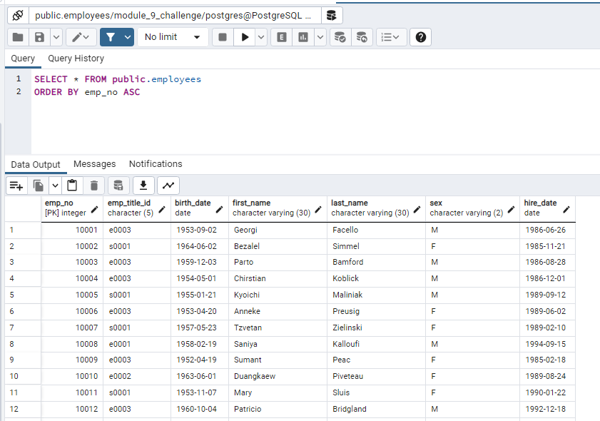
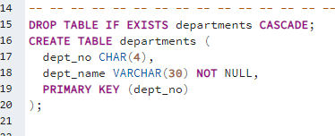
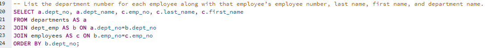

# Module 9: SQL Challenge

<ins>Project Overview</ins> 

For this project, I completed a research task about company employees for Pewlett Hackard (...not to be confused with the *very real* company, Hewlett Packard...) during the 19802 and 1990s. I used the remaining six CSV files to design tables from these files, imported the CSV files into pgAdmin 4 and ran queries to answer questions about the data.

<ins>Process and Technologies</ins>

This application is designed to showcase the aspects of pgAdmin 4 such as table creation & management, importing CSV files and running queries. After the tables were created and the data was imported, I was able to run queries such as 'List the manager of each department along with their department number, department name, employee number, last name, and first name.' and 'List the frequency counts, in descending order, of all the employee last names (that is, how many employees share each last name).'. 

<ins>Challenges<ins>

The two biggest challenges that I faced during this project was the assignment of primary and foreign keys and loading the data into the tables in pgAdmin 4. Originally, I tried to use QuickDBD to create the primary and foreign key connections, but I soon realized that there were errors in my assignments because each time I would load data into a table, it would break the connection to the previous CSV and delete the data from a different table. Once I had all the primary and foreign keys assigned for each CSV, my tutor, Kyle Goode, helped me to understand that I need to load the CSV data in an order that makes sense for the tables to be created. For example, I cannot load a CSV that relies on the primary key of a table that hasn't been populated yet. After this revelation, I was able to view all the data and complete the project.
